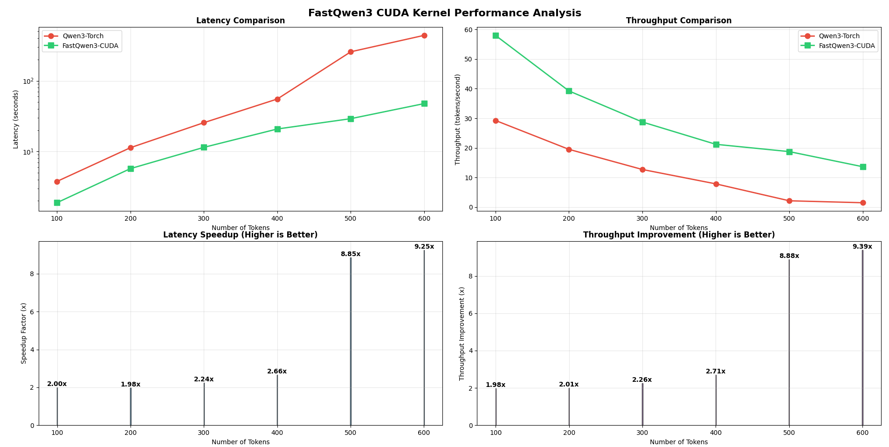
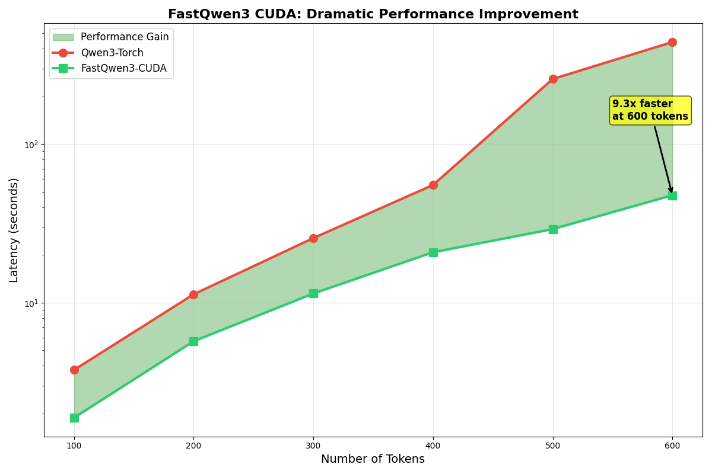

# Model Go Brrr

This repository is a collection of experiments and implementations of custom Triton kernels for accelerating large language models. It's a personal project driven by a passion for making models run as fast as possible. This is not intended to be a production-ready library, but rather a playground for exploring performance optimizations in the world of deep learning.

## Model

Currently optimized Qwen3 0.6B parameter model using fused cuda kernels and KV Cache




## Implemented Kernels

This repository contains custom Triton and CUDA kernels for the following operations:
#### TRITON
*   **Grouped-Query Attention (GQA):** An optimized GQA implementation that leverages Triton to fuse operations and reduce memory bandwidth.
*   **Fused Feed-Forward Network (FFN) with SiLU:** A fused FFN that combines the linear transformations and SiLU activation into a single kernel, reducing kernel launch overhead and improving data locality.
*   **RMS Normalization:** A custom Triton implementation of RMS Normalization for improved performance over the standard PyTorch version.
*   **Flash Attention:** A Triton implementation of the Flash Attention algorithm for efficient attention computation.
*   **Fused Linear:** A fused linear layer implementation.

#### CUDA
* **RMS Norm**
* **RoPE**
* **Flash attention**

>**More comming soon**

## Getting Started

To run the code in this repository, you will need to have PyTorch and Triton installed. You will also need to download the Qwen3-0.6B model weights.

1.  **Clone the repository:**
    ```bash
    git clone https://github.com/your-username/model_go_brr.git
    ```
2.  **Install dependencies:**
    ```bash
    pip install torch triton
    ```
3.  **Download the model weights:**
    Download the Qwen3-0.6B model from the Hugging Face Hub and place it in the `Qwen3-0.6B` directory.
4.  **Run the inference script:**
    ```bash
    python llm/qwen3/qwen_fast.py
    ```

## Disclaimer
This is a personal project and is not intended for production use. The code is provided as-is, without any guarantees of correctness or performance.
